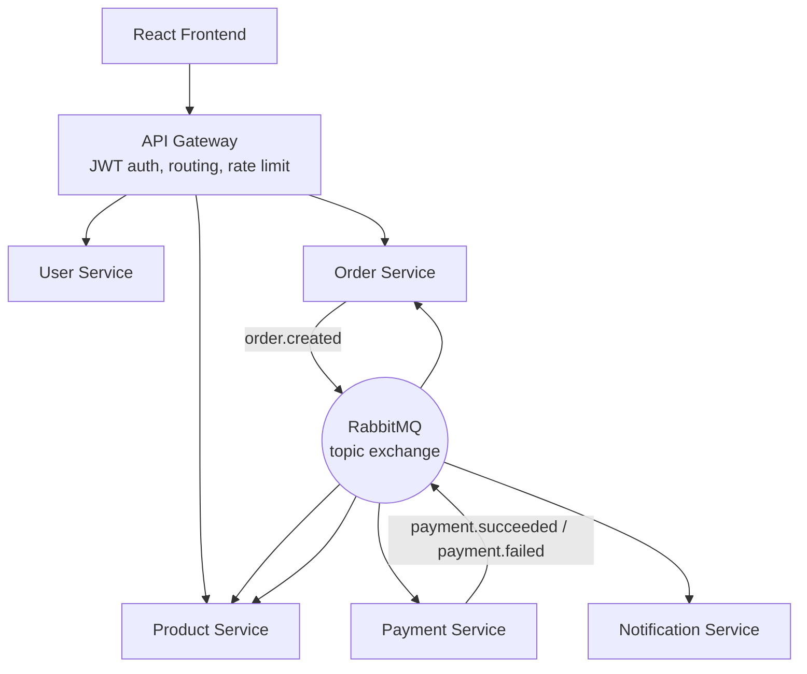
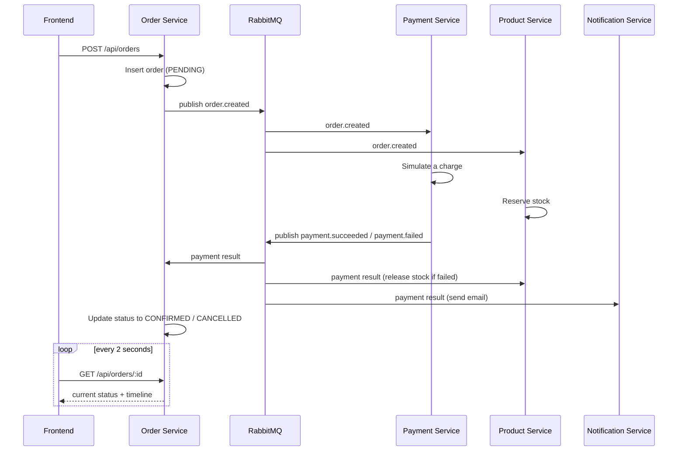
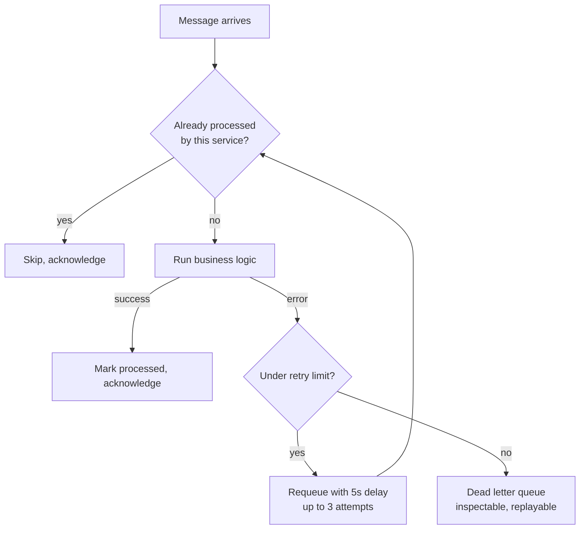

# Architecture Walkthrough

A complete explanation of how this system works, end to end — written so you can read it once and then explain it to someone else without notes.

## The Big Picture

The system has two layers:

1. **A request/response layer** — the React frontend talks to a single API Gateway, which routes to User Service, Product Service, and Order Service.
2. **An event-driven layer** — services talk to *each other* asynchronously through RabbitMQ, without ever calling one another directly or knowing the others exist.

## The Order Saga, Step by Step

This is the single most important flow to be able to explain fluently — it's the whole point of the "event-driven" part of the architecture.

**Key things to be able to say out loud about this flow:**

- Order Service never calls Payment Service directly — it publishes one message and moves on, trusting that something will eventually react and report back.
- Payment Service and Product Service both react to `order.created` independently and in parallel — there's no coordination between them.
- If payment fails, Product Service's stock release is a compensating transaction — it actively undoes work it already did, rather than just detecting the failure.
- The frontend never touches RabbitMQ. The "live" feel of checkout comes entirely from polling a database row that other services are updating in the background — not from WebSockets or any push technology.

## The Reliability Layer

Every message consumer wraps its handler in the same three-part safety net, so a crash mid-processing or a network hiccup can't silently corrupt state.

- **Idempotency** — a `processed_events` table, keyed per-service (not globally), so the same message can be safely delivered more than once.
- **Retry with backoff** — a transient failure gets a second (and third) chance before being treated as permanent.
- **Dead-letter queue** — after 3 failures, the message stops retrying and lands somewhere visible, with admin endpoints to inspect and replay it.

## Three Real Bugs This Design Exposed

These are worth being able to explain precisely — each one produced no error and no crash, just silently incorrect behavior:

1. **Missing message IDs** — every message after the first was wrongly treated as a duplicate, because the idempotency check had nothing real to key on.
2. **RabbitMQ rewrites the routing key on dead-letter redelivery** — code that trusted the routing key on a retried message silently did nothing instead of actually retrying.
3. **A globally-scoped idempotency table** — when one event fanned out to three services, whichever processed it first silently blocked the other two from doing their own independent work.

## The Frontend Side

- **Cart** — Context API + `useReducer`, scoped per logged-in user (fixed a real bug where a shared `localStorage` key leaked one user's cart to another).
- **Checkout** — one write (`POST /orders`), then pure polling (`GET /orders/:id` every 2s) rendering the backend's real status and persisted event timeline.
- **Order history** — reads the same timeline retrospectively; a week-old cancelled order shows the identical millisecond-precision sequence a live one does.

## Testing and CI

Every backend service has Jest tests with all I/O (database, RabbitMQ) fully mocked — tests run in milliseconds and verify logic, not infrastructure. GitHub Actions runs all 6 suites in parallel on every push and pull request via a matrix strategy.