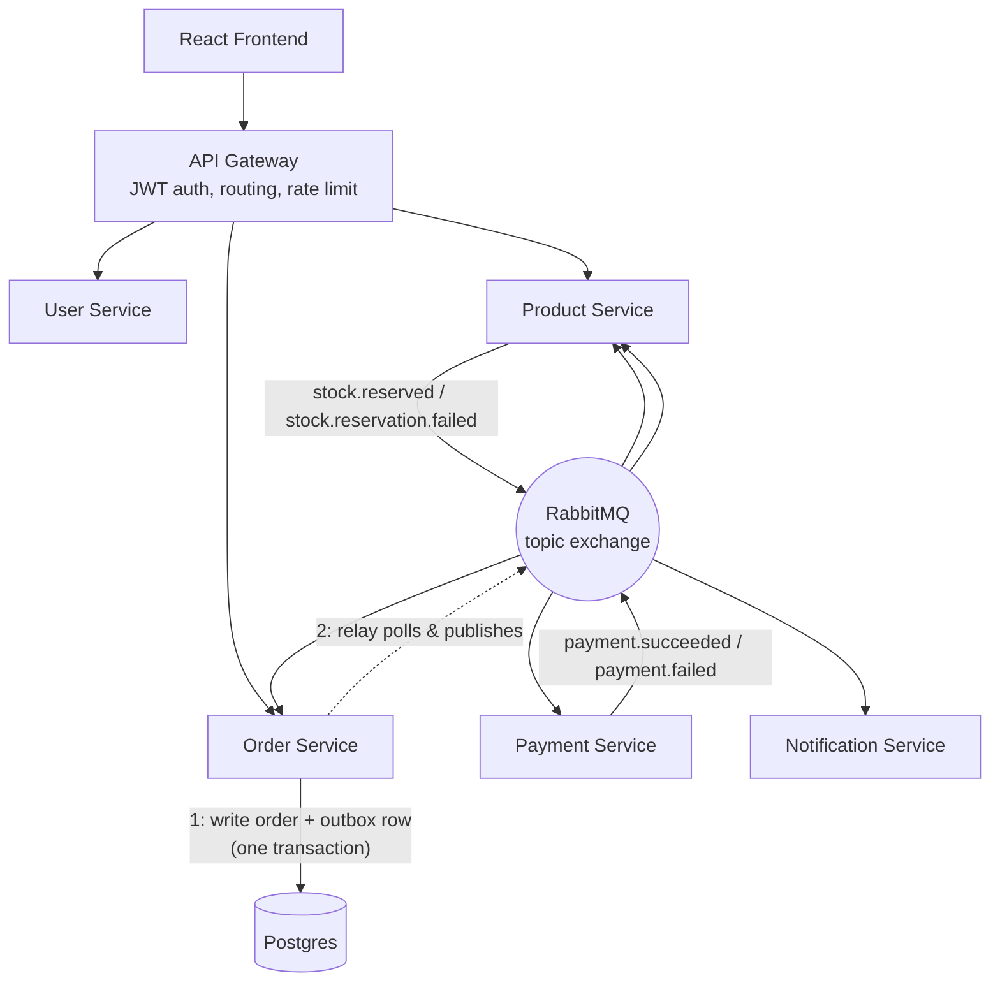
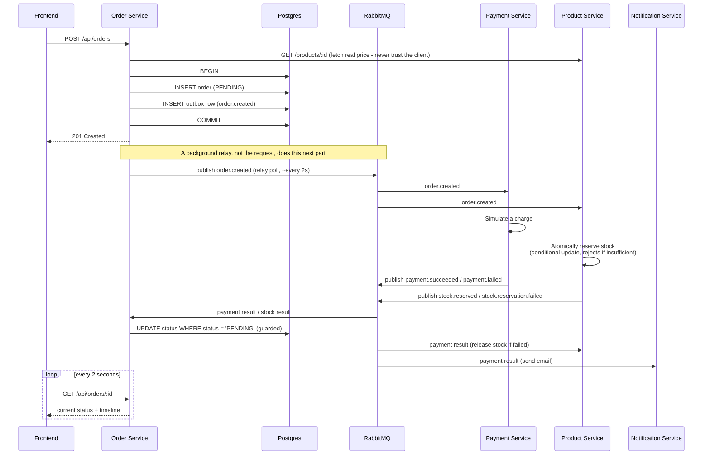
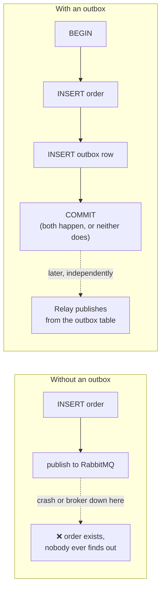
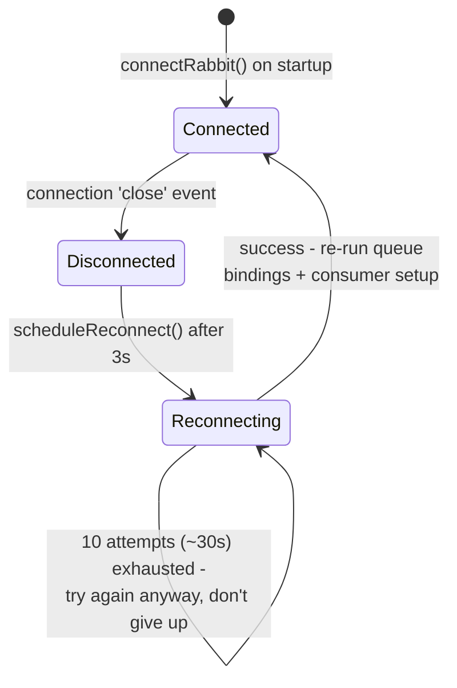

# Architecture Walkthrough

A complete explanation of how this system works, end to end — written so you can read it once and then explain it to someone else without notes. It covers not just what each piece does, but *why it exists*: every pattern here was added because something broke without it, and knowing the failure mode is what makes the pattern make sense.

## The Big Picture

The system has two layers:

1. **A request/response layer** — the React frontend talks to a single API Gateway, which routes to User Service, Product Service, and Order Service.
2. **An event-driven layer** — services talk to *each other* asynchronously through RabbitMQ, without ever calling one another directly or knowing the others exist.



Two details in that diagram matter more than they look: the dotted line out of Order Service (a relay, not a direct publish), and the fact that every consumer of `Bus` reconnects to it on its own if the connection drops. Both are covered in their own sections below, because both were added *after* a real failure made it obvious they were missing.

## The Order Saga, Step by Step

This is the single most important flow to be able to explain fluently — it's the whole point of the "event-driven" part of the architecture.



**Key things to be able to say out loud about this flow:**

- Order Service never calls Payment Service directly — it writes an event and moves on, trusting that something will eventually react and report back.
- The price used for the order is looked up by Order Service itself, from Product Service, at order-creation time. The client's request only ever says *which* product and *how many* — never the price. That's a deliberate, not incidental, design choice (see [Security](#security-model) below).
- Payment Service and Product Service both react to `order.created` independently and in parallel — there's no coordination between them. That's *why* the status update has to be guarded (see below): two independent, uncoordinated services racing to decide an order's fate is exactly the situation where a naive "just overwrite the status" update goes wrong.
- If payment fails, Product Service's stock release is a compensating transaction — it actively undoes work it already did, rather than just detecting the failure.
- The frontend never touches RabbitMQ. The "live" feel of checkout comes entirely from polling a database row that other services are updating in the background — not from WebSockets or any push technology.

## The Transactional Outbox Pattern

**The problem it solves.** Order Service needs to do two things that can't share one atomic operation by default: write the order to Postgres, and tell RabbitMQ about it. Those are two different systems. If the process crashes — or RabbitMQ is briefly unreachable — in the gap between "the INSERT committed" and "the publish call ran," the order exists, permanently `PENDING`, and nothing will ever tell the rest of the system it happened. No error, no crash. Just an order that silently never resolves.



**The fix.** The event is written as a row in an `outbox_events` table, inside the *same* Postgres transaction as the order `INSERT`. Either both commit, or neither does — there's no gap for a crash to land in. A separate background relay (`outbox.js`), running on a timer, polls for unpublished rows and hands them to RabbitMQ, marking each one published only after the send succeeds.

**The subtle part worth understanding.** The relay reuses the *same* message ID every time it retries a row — it doesn't generate a fresh one per attempt. That matters because if the relay crashes right after RabbitMQ accepts the message but before it marks the row published, the next tick will try to publish that row again. Reusing the ID means the redelivery looks identical to the first attempt to whatever consumes it downstream, which is exactly what the idempotency layer (below) is built to catch. The outbox pattern and the idempotency layer aren't two unrelated reliability features — the outbox *needs* idempotent consumers to be safe, and this system already had them.

## Connection Resilience

**The failure that motivated this.** Early testing stopped the RabbitMQ container to see what would happen, then started it back up. Every service kept running — no crash — but every one of them went completely silent. No new messages consumed, no new events published, forever, until each container was manually restarted. The root cause: every service connected to RabbitMQ exactly once, at startup. There was no code anywhere that noticed the connection had dropped.



**The fix, and the bug found inside the fix.** Every service now listens for its connection's `close` event and reconnects automatically, re-establishing its queue bindings and consumer registration from scratch (a fresh channel has none of the old one's state). The first version of this fix still had a bug: the retry loop was capped at 10 attempts over ~30 seconds, which was meant as a *startup* grace period, but was being reused for *reconnection* too. An outage that outlasted 30 seconds — which happened for a mundane reason, Docker's DNS for the RabbitMQ hostname taking a moment to become resolvable again after a restart — left the service permanently disconnected anyway, just more slowly than before. The real fix: exhausting one retry cycle schedules another one, indefinitely, rather than giving up.

## The Reliability Layer

Every message consumer wraps its handler in the same safety net, so a crash mid-processing or a network hiccup can't silently corrupt state.

```mermaid
flowchart TD
    A[Message arrives] --> B[BEGIN transaction]
    B --> C["INSERT INTO processed_events<br/>ON CONFLICT DO NOTHING"]
    C --> D{Row inserted?}
    D -- "no - already claimed" --> E[ROLLBACK, acknowledge<br/>(someone else has it)]
    D -- "yes - we own it" --> F[Run business logic]
    F -- success --> G[COMMIT, then acknowledge]
    F -- error --> H[ROLLBACK the claim too]
    H --> I{Under retry limit?}
    I -- yes --> J[Requeue with 5s delay<br/>up to 3 attempts]
    I -- no --> K[Dead letter queue<br/>inspectable, replayable]
```

**Why the claim is inside the transaction, not a separate step.** The first version of this checked for a duplicate with a `SELECT`, and separately marked a message processed with an `INSERT` after the handler succeeded. Two deliveries of the same message, arriving close enough together, could both pass the `SELECT` before either finished its `INSERT` — both would then run the handler. The fix collapses "check" and "claim" into one atomic statement, `INSERT ... ON CONFLICT (message_id, service_name) DO NOTHING`, and — just as importantly — runs it in the *same transaction* as the handler's own work. If the handler fails, the `ROLLBACK` undoes the claim along with everything else, so a retried message isn't mistaken for a duplicate of itself. If the handler succeeds, the claim and the result commit together. There's no window where a crash can leave the claim committed but the work half-done, or the work done but the claim missing.

- **Atomic idempotency** — described above; a `processed_events` table, keyed per-service (not globally), so the same message can be delivered more than once without being processed more than once.
- **Retry with backoff** — a transient failure gets a second (and third) chance before being treated as permanent.
- **Dead-letter queue** — after 3 failures, the message stops retrying and lands somewhere visible, with admin endpoints to inspect and replay it.

## Guarded Status Transitions

An order's status update looks like a simple `UPDATE`, but it's a real concurrency problem: Payment Service and Product Service react to `order.created` independently, so their results can arrive in either order, and either one can be redelivered. Without a guard, a late or redelivered `payment.failed` arriving *after* the order was already `CONFIRMED` would flip it back to `CANCELLED` — silently corrupting a decision that had already been made and acted on.

The fix keeps the check and the write as one atomic statement, the same principle as the idempotency claim above:

```sql
UPDATE orders SET status = $1, cancellation_reason = $2, updated_at = NOW()
WHERE id = $3 AND status = ANY($4)   -- e.g. $4 = ['PENDING']
RETURNING id, status, cancellation_reason;
```

If the row's current status isn't in the allowed list, the `WHERE` clause matches nothing, `RETURNING` comes back empty, and the caller knows the transition was refused — without a race window between checking the status and writing the new one. `CONFIRMED` and `CANCELLED` are terminal: nothing can move an order out of them once it gets there. This was verified directly against a real PostgreSQL instance by firing 30 concurrent conflicting events at a single order — exactly one ever wins.

## Security Model

- **Price trust** — `POST /orders` accepts only a product ID and a quantity from the client. Order Service looks up the real, current price from Product Service itself before calculating the total. Trusting a client-supplied price would let anyone submit `price: 0.01` for a real product.
- **Ownership checks** — `GET /orders/:id` verifies the requesting user owns the order (returning 404, not 403, so an order's existence isn't leaked to someone who doesn't own it).
- **Role-based access control** — admin-only routes (`/admin/dlq`, product mutation endpoints) check a real `isAdmin` boolean baked into the JWT at login, not just "any authenticated request." This is enforced the same way whether the request comes through the Gateway or hits a service's own port directly.
- **Network isolation** — only the API Gateway and the frontend are published to the host. Every backend service is reachable only through the Gateway or Docker's internal network, closing off the direct-port bypass that the RBAC checks above also defend against independently (defense in depth: either control failing alone still leaves the other standing).

## The Frontend Side

- **Cart** — Context API + `useReducer`, scoped per logged-in user (fixed a real bug where a shared `localStorage` key leaked one user's cart to another).
- **Checkout** — one write (`POST /orders`), then pure polling (`GET /orders/:id` every 2s) rendering the backend's real status and persisted event timeline. The post-order summary displays the server's returned price and total, not the client's pre-checkout cart snapshot — those can now legitimately differ, since the server independently verifies price.
- **Order history** — reads the same timeline retrospectively; a week-old cancelled order shows the identical millisecond-precision sequence a live one does.

## Testing and CI

Every backend service has Jest tests with all I/O (database, RabbitMQ) fully mocked — tests run in milliseconds and verify logic, not infrastructure. 211 tests across all 6 services. GitHub Actions runs them all in parallel on every push and pull request via a matrix strategy.

Mocked tests have a real limit: they can't honestly prove what happens under a genuine concurrent race, a killed database connection, or two transactions actually competing for the same row — a mock just returns whatever you told it to return. Several of the bugs described above (the idempotency race, the status-transition race, a connection dying mid-transaction) were only caught by running the real handler code against a real, running PostgreSQL instance and deliberately trying to break it — firing dozens of concurrent requests at it, or killing a connection mid-transaction from another session. That kind of verification isn't part of the CI suite, since it needs live infrastructure rather than mocks, but it's the difference between a test that proves the code runs and a test that proves the guarantee actually holds.
