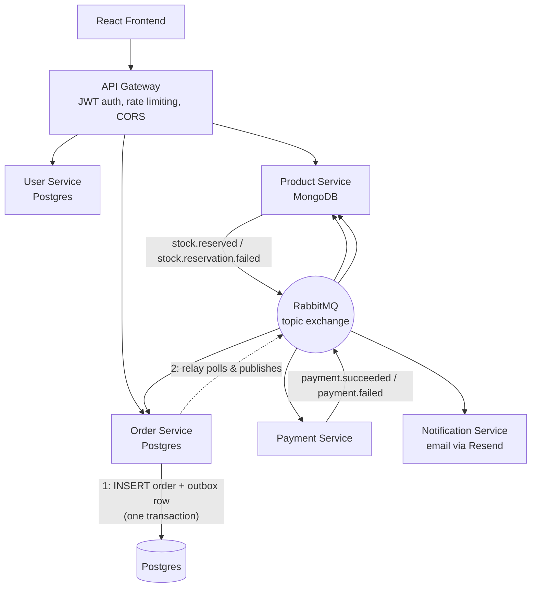

# Event-Driven E-Commerce System


A distributed, event-driven e-commerce platform: 6 independent microservices communicating asynchronously over RabbitMQ, coordinating order fulfillment through a saga pattern, backed by production-grade reliability engineering — transactional outbox, atomic idempotency, automatic connection recovery, retry with backoff, and dead-letter queues.

This isn't a tutorial clone. Every pattern below was hardened against a real failure mode I found by deliberately breaking the system — killing RabbitMQ mid-traffic, terminating live database connections, firing concurrent conflicting events at the same order — and fixing what broke, including bugs inside my own fixes. That process, and what it turned up, is documented in detail below because it's the part of this project I'm proudest of.

## Skills Demonstrated

- **Distributed systems design** — 6 independently deployable services, each owning its own database, communicating only through events or a gateway; no service reaches into another's data
- **Event-driven architecture with a real saga** — order creation, payment, inventory, and notifications coordinated across services via a RabbitMQ topic exchange, with compensating transactions on failure
- **Transactional outbox pattern** — order creation and its event are written in a single Postgres transaction, so a crash or a dead broker can never leave an order that exists with no guarantee its event will ever be sent
- **Fault-tolerant messaging** — every service detects a dropped RabbitMQ connection, rebinds its queues, and resumes consuming automatically, with unbounded retry rather than giving up after one attempt
- **Atomic concurrency control** — idempotent event processing via a single `INSERT ... ON CONFLICT DO NOTHING` inside the handler's own transaction (not a racy check-then-insert), and atomic stock reservation via `findOneAndUpdate` with a conditional filter (not a racy read-modify-write)
- **Security-conscious backend engineering** — server-side price verification (never trust a client-supplied price), real role-based access control backed by a JWT claim (not "any logged-in user"), and ownership checks on every resource
- **Full-stack ownership** — React/Vite frontend, Node/Express backend, PostgreSQL + MongoDB, JWT auth, all containerized with Docker Compose
- **Testing discipline that goes beyond mocks** — Jest suites across all 6 services (211 tests), plus targeted verification against a real, running PostgreSQL instance for anything mocks can't prove: concurrent transactions, killed connections, and race conditions

## Architecture



Every arrow into and out of RabbitMQ survives a broker restart: publishers write to an outbox instead of publishing directly, and every consumer reconnects and re-subscribes automatically if the connection drops. Both of those are load-bearing design decisions, not defaults — see [Real Bugs Found and Fixed](#real-bugs-found-and-fixed) for what happens without them.

## The Order Saga

Placing an order triggers a real, asynchronous chain of events — the heart of the system:

1. **Order Service** inserts the order (`PENDING`) and an outbox row in one Postgres transaction, then returns immediately. A background relay polls the outbox and publishes `order.created` to RabbitMQ — decoupling "the order was created" (guaranteed) from "the broker received the event" (best-effort, retried until it succeeds)
2. **Payment Service** and **Product Service** independently react to that same event — Payment Service simulates a charge; Product Service atomically reserves stock, rejecting the reservation outright (and rolling back any items already taken) if stock is insufficient
3. Payment Service publishes `payment.succeeded` / `payment.failed`; Product Service publishes `stock.reserved` / `stock.reservation.failed`
4. **Order Service** moves the order to `CONFIRMED` or `CANCELLED` — but only from `PENDING`; a terminal order can never be overwritten by a late or redelivered event. **Product Service** releases reserved stock on failure (a compensating transaction); **Notification Service** sends a real email

Every step is recorded as a persisted, millisecond-precision timeline entry — visible live in the frontend as the order resolves, and permanently in order history afterward.

## Reliability Patterns

- **Transactional outbox** — publishing is never done inline in a request handler. The event is written to an `outbox_events` table in the same transaction as the business change, and a separate relay delivers it, reusing the same message ID on every retry so a redelivery is caught as a duplicate downstream rather than processed twice
- **Atomic idempotency** — `processed_events` claims are made with `INSERT ... ON CONFLICT (message_id, service_name) DO NOTHING` inside the same transaction as the handler itself. The claim only commits if the handler succeeds; a crash or failure rolls the claim back too, so a message is never lost *or* silently double-counted
- **Connection resilience** — every consumer listens for its RabbitMQ connection closing, and reconnects with unbounded retry (not a fixed timeout that eventually gives up), re-binding its queues and resuming consumption with no manual intervention
- **Ordered status transitions** — `CONFIRMED` and `CANCELLED` are terminal. The transition is enforced in the `UPDATE ... WHERE status = ANY(...)` itself, so it's atomic even under concurrent conflicting events, not a separate check-then-write
- **Retry with backoff + dead-letter queue** — transient failures get requeued with a delay (up to 3 attempts) before landing in an inspectable DLQ, with admin endpoints to review and replay
- **Role-based access control** — admin routes check a real `isAdmin` JWT claim, not just "any authenticated request"; product mutation and DLQ endpoints are protected the same way whether reached through the gateway or a service's own port

## Real Bugs Found and Fixed

The most valuable part of building this wasn't writing the reliability patterns — it was breaking them on purpose to find out where they were still wrong. Every bug below was found through deliberate testing against a running system (or a real PostgreSQL 16 instance for anything a mock couldn't honestly prove), not discovered by accident.

**Concurrency & data races**

| Bug | Impact | How it was found |
|---|---|---|
| Idempotency was check-then-insert (`SELECT` then `INSERT`) | Two concurrent deliveries of the same message could both pass the check and both run the handler | Fired 25 concurrent deliveries of the same message at the real handler against live PostgreSQL — replaced with a single atomic `INSERT ... ON CONFLICT DO NOTHING` |
| Stock reservation was read-modify-write (`findById` → mutate → `.save()`) | Two concurrent orders for the last unit of stock could both read "available" and both succeed — classic overselling | Replaced with `findOneAndUpdate({ stock: { $gte: qty } }, { $inc: { stock: -qty } })`, a single atomic conditional update |
| Order status had no transition guard | A late or redelivered `payment.failed` could flip an already-`CONFIRMED` order back to `CANCELLED` | Fired 30 concurrent conflicting events at one order against live PostgreSQL — exactly one now ever applies, verified directly |
| `Reservation.status` enum didn't include `FAILED` | Mongoose silently rejected the write my own atomic-stock rewrite introduced, so a failed reservation would never publish `stock.reservation.failed` and the order would hang `PENDING` forever | A schema test against the *real* model (the saga tests mock it, so they couldn't have caught this) — reverted the fix to confirm the new test actually fails without it |
| `payment.failed` arriving before `order.created` for the same order | The late reservation would still succeed and reserve stock for an order that was already cancelled — a permanent stock leak | Observed in a real backlog after a RabbitMQ outage; fixed by having a release with nothing to release write a tombstone row that the reservation path checks for |

**Distributed systems reliability (found via chaos testing)**

| Bug | Impact | How it was found |
|---|---|---|
| No RabbitMQ reconnect logic anywhere | A dropped connection left every consumer silently idle forever — no crash, no error, just a channel that throws on every use until the process is manually restarted | Stopped and started the RabbitMQ container while traffic was flowing; watched a service go completely silent and stay that way |
| Reconnect gave up after one 30-second retry window | A connection drop that outlasted 30 seconds left the service disconnected permanently, even with reconnect logic in place | The same chaos test, run again after the first fix — a `getaddrinfo ENOTFOUND` during Docker's brief post-restart DNS window exhausted the retry budget before RabbitMQ was actually reachable |
| Outbox relay's `publishEvent` silently returned instead of throwing when the channel wasn't ready | The relay would have marked an event as published when it never left the process — silent data loss, the exact failure the outbox pattern exists to prevent | Code review while building the reconnect fix, confirmed by a test that asserts the relay leaves the row unpublished on a failed send |
| Payment result emails were dropped on a Resend 429 | A backlog draining after an outage exceeded the provider's rate limit; the error was logged but swallowed, so the message was ACKed and the email lost for good with no retry | A real 429 surfaced in the logs while draining a backlog after a RabbitMQ outage |

**Security**

| Bug | Impact | How it was found |
|---|---|---|
| `POST /orders` trusted a client-supplied `price` | Intercepting the request and submitting `price: 0.01` for a real product would charge almost nothing for it | Security review of the checkout flow — fixed by having Order Service fetch the authoritative price from Product Service itself |
| `GET /orders/:id` had no ownership check | Any authenticated user could fetch any other user's order by guessing its ID | Writing the test suite's authorization tests |
| `/admin/dlq` had no role check at all on two of the four services that exposed it | Any valid JWT — not just an admin's — could view and replay the dead-letter queue | Security review after fixing the first two; RBAC now checks a real `isAdmin` claim baked into the JWT at login, consistently across every service |
| Product mutation endpoints (`POST /products`, stock updates) had zero auth on the service's own port | Reachable directly, bypassing the Gateway entirely, by anyone who could reach that port | Same review; fixed the same way as the DLQ endpoints |
| Cross-account cart leak via a single shared `localStorage` key | Logging in as a different user on the same browser showed the previous user's cart | Manual end-to-end testing |

## Tech Stack

**Backend** — Node.js, Express, PostgreSQL, MongoDB, RabbitMQ, JWT, Jest

**Frontend** — React, Vite, Tailwind CSS v4, TanStack Query, React Hook Form, Context API + `useReducer`

## Features

- JWT authentication with persistent sessions and role-based access control
- Product catalog with category filtering and search (including synonym matching — searching "mobile" finds phones)
- Per-user, `localStorage`-persisted shopping cart
- Checkout with **live order-status polling** — watch an order resolve from `PENDING` to `CONFIRMED`/`CANCELLED` in real time, no refresh
- A **persisted, millisecond-precision order timeline** for every saga step, including stock-reservation failures
- Order history with cancellation reasons
- Transactional email notifications (order confirmed / cancelled) via Resend
- Dark/light theme, responsive UI

## Getting Started

### Prerequisites
- Docker & Docker Compose
- MongoDB running locally (Product Service connects to it via `host.docker.internal`)

### Setup

```bash
git clone <this-repo>
cd event-driven-ecommerce
cp .env.example .env
docker-compose up --build
```

Seed the product catalog:
```bash
docker-compose exec product-service npm run seed
```

- Frontend: http://localhost:5173
- API Gateway: http://localhost:4000
- RabbitMQ Management UI: http://localhost:15672 (`admin` / `admin123`)

Only the Gateway (4000) and the frontend are published to the host — every other service is reachable only through the Gateway or the internal Docker network, closing off the direct-port-access bypass described above.

### Promoting an admin user

There's no UI for this by design; it's a deliberate, manual action:

```bash
docker-compose exec postgres psql -U admin -d ecommerce \
  -c "UPDATE users SET is_admin = TRUE WHERE email = 'you@example.com';"
```

Log in again afterward — `isAdmin` is baked into the JWT at login, so an existing session won't pick up the change.

### Verifying a production frontend build

```bash
docker-compose exec frontend npm run build
docker-compose exec frontend npm run preview
```

## Running Tests

Every backend service has its own Jest suite, fully mocked (no live database or RabbitMQ connection required) — 211 tests across all 6 services:

```bash
docker-compose run --rm order-service npm test
docker-compose run --rm payment-service npm test
docker-compose run --rm product-service npm test
docker-compose run --rm notification-service npm test
docker-compose run --rm user-service npm test
docker-compose run --rm api-gateway npm test
```

These run automatically via **GitHub Actions** on every push and pull request (`.github/workflows/backend-tests.yml`).

Mocked tests can't honestly prove a real database transaction, a killed connection, or a genuine concurrent race — several of the bugs above were only caught by running the actual handler against a real, running PostgreSQL 16 instance (concurrent duplicate deliveries, a connection terminated mid-transaction, and 30 conflicting events fired at one order). That verification isn't part of the CI suite, since it requires live infrastructure rather than mocks, but it's what the "Real Bugs Found and Fixed" table above is describing.

## Project Structure
```
.
├── api-gateway/
├── frontend/
├── services/
│   ├── user-service/
│   ├── product-service/
│   ├── order-service/
│   ├── payment-service/
│   └── notification-service/
├── .github/workflows/
└── docker-compose.yml
```

## Known Limitations

- Payment Service simulates outcomes (10% decline rate, 10% simulated transient failure) rather than integrating a real payment provider — there is currently no refund path for the case where a payment succeeds but stock reservation fails independently and the order is cancelled anyway
- Single-instance services — the reliability design assumes one instance per service, not horizontal scaling (the outbox relay in particular would need `FOR UPDATE SKIP LOCKED` to be safe with multiple instances)
- Product Service's own writes (Mongo) aren't wrapped in the same transactional-outbox guarantee Order Service has, since MongoDB transactions require a replica set this project doesn't run — Order Service is the only service where "wrote the business record" and "guaranteed to eventually publish" are fully atomic
- A handful of Postman-style test fixture files (`login.json`, `order.json`, etc.) still live at the repo root and should move into a `test-fixtures/` folder
