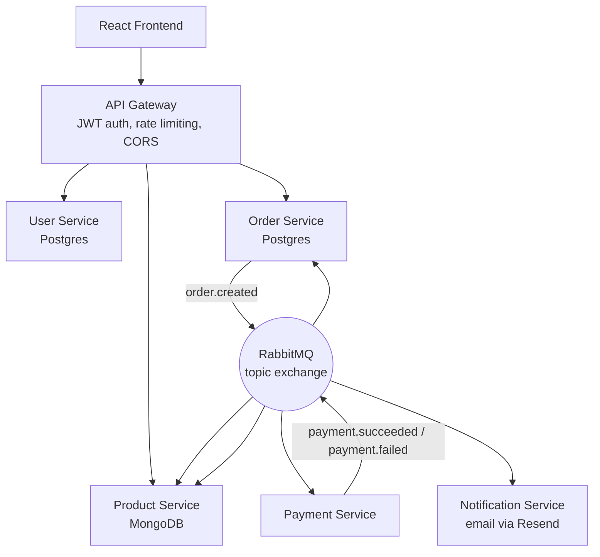

# Event-Driven E-Commerce System


A distributed, event-driven e-commerce platform: 6 independent microservices communicating asynchronously over RabbitMQ, coordinating order fulfillment through a saga pattern, backed by production-grade reliability engineering (idempotency, retry with backoff, dead-letter queues) — not a monolith split into folders, and not a tutorial clone.

## Skills Demonstrated

- **Distributed systems design** — 6 independently deployable services, each owning its own database, communicating only through events or a gateway — no service reaches into another's data
- **Event-driven architecture** — a real saga pattern coordinating order creation, payment, inventory, and notifications across services via a RabbitMQ topic exchange
- **Production reliability engineering** — idempotency, exponential backoff retry, and dead-letter queues, built from scratch and hardened against real bugs (see below)
- **Full-stack ownership** — React/Vite frontend, Node/Express backend, PostgreSQL + MongoDB, JWT auth, all containerized with Docker Compose
- **Testing discipline** — Jest unit test suites across all 6 backend services (mocked dependencies, no live infrastructure required), running automatically in CI on every push
- **Security-conscious debugging** — found and fixed a real authorization bypass and a cross-account data leak, both through deliberate testing and end-to-end verification, not by accident

## Architecture



## The Order Saga

Placing an order triggers a real, asynchronous chain of events — the heart of the system:

1. **Order Service** inserts the order (`PENDING`) and publishes `order.created` to a RabbitMQ topic exchange
2. **Payment Service** and **Product Service** independently react to that same event — Payment Service simulates a charge; Product Service reserves stock
3. Payment Service publishes `payment.succeeded` or `payment.failed`
4. **Order Service** updates the order to `CONFIRMED`/`CANCELLED`; **Product Service** releases reserved stock on failure (a compensating transaction); **Notification Service** sends a real email

Every step is recorded as a persisted, millisecond-precision timeline entry — visible live in the frontend as the order resolves, and permanently in order history afterward.

## Reliability Patterns

Every consumer wraps its message handling in three layers:

- **Idempotency** — a `processed_events` table, scoped per-service (not globally), prevents duplicate processing when RabbitMQ redelivers a message
- **Retry with backoff** — transient failures get requeued with a delay (up to 3 attempts) before being treated as permanent
- **Dead-letter queue** — messages that exhaust retries land somewhere inspectable, with admin endpoints to review and replay them

## Real Bugs Found and Fixed

This is the part worth reading closely — these are subtle distributed-systems failure modes that produce **no error, no crash, just silently incorrect behavior**, found through deliberate testing rather than luck:

| Bug | Impact | How it was found |
|---|---|---|
| Missing message IDs | Every message after the first was wrongly treated as a duplicate | Manual saga testing |
| RabbitMQ rewrites routing keys on dead-letter redelivery | Retried messages silently did nothing instead of retrying | Manual saga testing |
| Globally-scoped idempotency table | One event fanning out to 3 services meant whichever processed first silently blocked the other two | Manual saga testing |
| **Authorization bypass**: `GET /orders/:id` had no ownership check | Any authenticated user could fetch any other user's order by guessing its ID | Writing the test suite's authorization tests |
| **Cross-account cart leak**: a single shared `localStorage` key | Logging in as a different user on the same browser showed the previous user's cart | Manual end-to-end testing |
| Unauthenticated admin endpoints | `/admin/dlq` reachable with no auth when hit directly on a service's port, bypassing the Gateway | Security review |

## Tech Stack

**Backend** — Node.js, Express, PostgreSQL, MongoDB, RabbitMQ, JWT, Jest

**Frontend** — React, Vite, Tailwind CSS v4, TanStack Query, React Hook Form, Context API + `useReducer`

## Features

- JWT authentication with persistent sessions
- Product catalog with category filtering and search (including synonym matching — searching "mobile" finds phones)
- Per-user, `localStorage`-persisted shopping cart
- Checkout with **live order-status polling** — watch an order resolve from `PENDING` to `CONFIRMED`/`CANCELLED` in real time, no refresh
- A **persisted, millisecond-precision order timeline** for every saga step
- Order history with cancellation reasons
- Dark/light theme, responsive UI

## Getting Started

### Prerequisites
- Docker & Docker Compose
- MongoDB running locally (Product Service connects to it via `host.docker.internal`)

### Setup

```bash
git clone <this-repo>
cd event-driven-ecommerce
cp .env.example .env
docker-compose up --build
```

Seed the product catalog:
```bash
docker-compose exec product-service npm run seed
```

- Frontend: http://localhost:5173
- API Gateway: http://localhost:4000
- RabbitMQ Management UI: http://localhost:15672 (`admin` / `admin123`)

### Verifying a production frontend build

```bash
docker-compose exec frontend npm run build
docker-compose exec frontend npm run preview
```

## Running Tests

Every backend service has its own Jest suite, fully mocked (no live database or RabbitMQ connection required):

```bash
docker-compose run --rm order-service npm test
docker-compose run --rm payment-service npm test
docker-compose run --rm product-service npm test
docker-compose run --rm notification-service npm test
docker-compose run --rm user-service npm test
docker-compose run --rm api-gateway npm test
```

These run automatically via **GitHub Actions** on every push and pull request (`.github/workflows/backend-tests.yml`).

## Project Structure
.
├── api-gateway/
├── frontend/
├── services/
│ ├── user-service/
│ ├── product-service/
│ ├── order-service/
│ ├── payment-service/
│ └── notification-service/
├── .github/workflows/
└── docker-compose.yml
## Known Limitations

- Payment Service simulates outcomes (10% decline rate, 10% simulated transient failure) rather than integrating a real payment provider
- Single-instance services — the reliability design assumes one instance per service, not horizontal scaling
- No integration/E2E test suite yet — current tests are unit-level with mocked dependencies